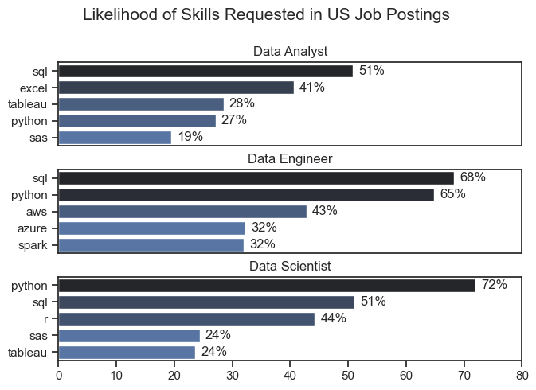
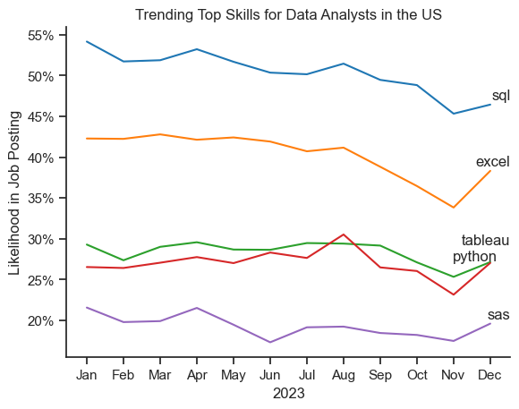
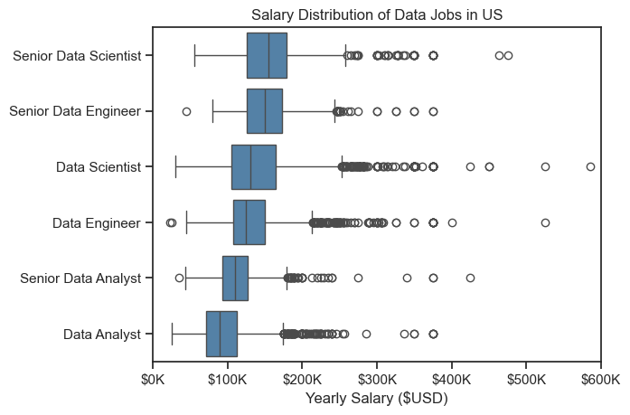
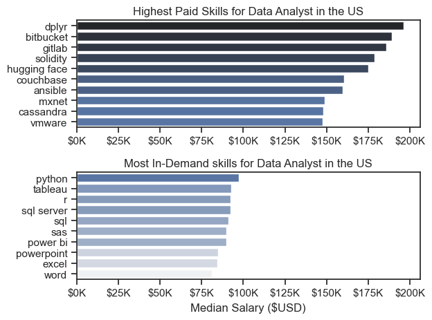
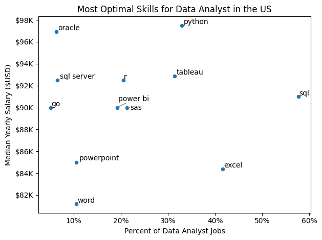
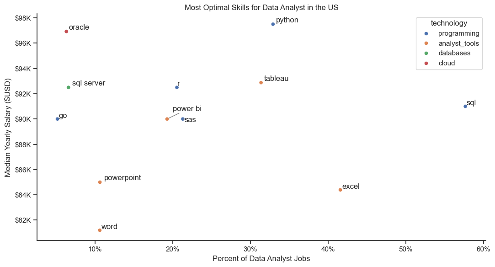

# 📊 Data Job Market EDA: Skills, Salaries & Optimal Career Paths

An end-to-end exploratory data analysis project examining **785,000+ real-world data job postings** to answer a practical question every aspiring data professional asks: *which skills are actually worth learning?* Using **Python (Pandas, Matplotlib, Seaborn)**, this project moves from raw job posting data to a clear, evidence-based skill-learning strategy for Data Analysts.

> 📁 Dataset: [Luke Barousse's Data Jobs Dataset (Hugging Face)](https://huggingface.co/datasets/lukebarousse/data_jobs)

## Skills Demonstrated

- **Data Cleaning (Python/pandas):** parsing stringified lists with `ast.literal_eval`, datetime conversion, exploding multi-value columns, resolving `SettingWithCopyWarning`
- **Exploratory Data Analysis:** `groupby`, `pivot_table`, percentage normalization across groups of different sizes, country/role-based filtering
- **Data Visualization (Matplotlib & Seaborn):** multi-panel bar charts, time-series trend lines, box plots for distribution comparison, scatter plots with custom axis formatting and automated label-collision handling (`adjustText`)
- **Analytical Reasoning:** turning open-ended career questions into structured, reproducible pandas workflows

## Project Overview

Job postings contain a lot of noise — this project cuts through it to answer four concrete questions for anyone planning a data career: what do employers actually ask for, how has that shifted over a year, what does each skill pay, and — most importantly — where do demand and salary overlap.

**Dataset:** 785,000+ postings covering job titles, salaries, posting dates, locations, and required skills across Data Analyst, Data Engineer, and Data Scientist roles.

---

## The Analysis

### 1. What are the most demanded skills for the top 3 most popular data roles?

Rather than looking at skills in isolation, I compared them side-by-side across the three most common data job titles, ranking each role's top 5 requested skills by the share of postings mentioning them. This makes it easy to see which skills are shared across roles and which are role-specific.

📓 [2_Skills_demand.ipynb](notebooks/2_Skills_Demand.ipynb)

#### Code

```python
fig, ax = plt.subplots(len(job_titles), 1)

for i, job_title in enumerate(job_titles):
    df_plot = df_skills_perc[df_skills_perc['job_title_short'] == job_title].head(5)
    sns.barplot(data=df_plot, x='skill_percent', y='job_skills', ax=ax[i], hue='skill_count', palette='dark:b_r')

plt.show()
```

#### Result



#### What stood out

- SQL isn't optional for any of the three roles — it lands in the top 2 skills for Analysts (51%), Engineers (68%), and Scientists (51%) alike, making it the closest thing to a universal requirement in this dataset.
- The gap in Python demand between Analysts (27%) and Scientists (72%) is the clearest signal in the whole chart — it marks where "analysis" ends and "modeling/engineering" begins as a skillset.
- Cloud tooling (AWS, Azure, Spark) only shows up in the Data Engineer panel, confirming that infrastructure knowledge is a distinct, separate track from analysis or data science skills.

---

### 2. How are in-demand skills trending for Data Analysts?

A single-year snapshot hides whether a skill is rising or fading. I broke down the top 5 Data Analyst skills by posting month across 2023, converting each to a percentage of that month's postings so the trend isn't distorted by month-to-month volume changes.

📓 [3_Skills_trend.ipynb](notebooks/3_Skills_Trend.ipynb)

#### Approach
1. Aggregate skill mentions per month
2. Normalize to percent of that month's total postings
3. Plot all 5 skills on one timeline

#### Code

```python
df_plot = df_DA_US_perc.iloc[:, :5]

sns.lineplot(data=df_plot, dashes=False, palette='tab10')
sns.despine()

plt.title('Trending Top Skills for Data Analysts in the US')
plt.ylabel('Likelihood in Job Posting')
plt.xlabel('2023')
plt.legend().remove()

from matplotlib.ticker import PercentFormatter
ax = plt.gca()
ax.yaxis.set_major_formatter(PercentFormatter(decimals=0))

plt.show()
```

#### Result



#### What stood out

- SQL stayed on top all year, but it wasn't flat — demand slid from ~54% in January to a low of ~46% in November, a meaningful pullback even for the "safest" skill in the dataset.
- Excel had the roughest year of the top 5, dropping roughly 8 points (from ~42% to ~34%) — the clearest sign of the group that a foundational tool's demand isn't guaranteed to hold steady.
- Python and Tableau were the most stable, and both ticked upward again in December — a small but encouraging signal for anyone building toward these skills long-term rather than reacting to short-term dips.

---

### 3. How well do jobs and skills pay for Data Analysts?

Demand only tells half the story — the other half is compensation. I first zoomed out to compare salary ranges across six related data job titles (to see where Data Analyst sits in the broader pay ladder), then zoomed back in to compare specific skills within the Data Analyst role itself.

📓 [4_Salary_analysis.ipynb](notebooks/4_Salary_Analysis.ipynb)

#### Approach
1. Compare median salary across the top 6 data job titles
2. Compare median salary per skill, within Data Analyst postings only
3. Chart both the highest-paying and most-requested skills side by side

#### Code

```python
sns.boxplot(data=df_US_top6, x='salary_year_avg', y='job_title_short', order=job_order)

ticks_x = plt.FuncFormatter(lambda y, pos: f'${int(y/1000)}K')
plt.gca().xaxis.set_major_formatter(ticks_x)
plt.show()
```

#### Result



#### What stood out

- Data Analyst sits at the base of the pay ladder among the six roles compared — its salary band is the tightest and lowest, while Senior Data Scientist postings stretch as high as $600K.
- Seniority widens the spread, not just the median — Senior Data Engineer and Senior Data Scientist both show a long tail of high-salary outliers that their non-senior counterparts don't, suggesting specialization and experience unlock outsized pay rather than just incrementally better pay.
- Data Analyst's comparatively narrow, low-outlier distribution suggests it's a more standardized, entry-friendly role — useful context for someone deciding whether to specialize early or build broad analyst experience first.

### Highest-Paid vs. Most In-Demand Skills

Zooming into Data Analyst postings specifically, I plotted the top 10 highest-paid skills against the top 10 most in-demand skills — deliberately side by side, so the contrast between "what pays" and "what's asked for" is immediately visible.

#### Code

```python
fig, ax = plt.subplots(2, 1)

sns.barplot(data=df_DA_top_pay, x='median', y=df_DA_top_pay.index, hue=df_DA_top_pay.index, ax=ax[0], palette='dark:b', legend=False)
ax[0].set_title('Top 10 Highest Paid Skills for Data Analysts')
ax[0].set_xlabel('')
ax[0].xaxis.set_major_formatter(plt.FuncFormatter(lambda x, pos: f'${int(x/1000)}K'))

sns.barplot(data=df_DA_skills, x='median', y=df_DA_skills.index, hue=df_DA_skills.index, ax=ax[1], palette='light:b_r', legend=False)
ax[1].set_title('Top 10 Most In-Demand Skills for Data Analysts')
ax[1].set_xlabel('Median Salary ($USD)')
ax[1].xaxis.set_major_formatter(plt.FuncFormatter(lambda x, pos: f'${int(x/1000)}K'))

plt.tight_layout()
plt.show()
```

#### Result



#### What stood out

- None of the top-10 highest-paid skills (`dplyr`, `Bitbucket`, `GitLab`, and similar) overlap with the top-10 most in-demand list — the two charts share zero skills in common, which is a striking finding on its own.
- The highest-paying skills read like engineering/DevOps adjacencies rather than core analyst tools — suggesting the pay premium goes to analysts who can cross into technical/engineering territory, not to deeper analyst-tool expertise.
- The practical takeaway: a portfolio built purely around in-demand tools covers employability, but adding even one or two of these higher-paying, less common skills is what actually moves the salary needle.

---

### 4. What is the most optimal skill to learn for Data Analysts?

This is where the previous two analyses combine. Instead of treating demand and salary as separate charts, I plotted every skill on both axes at once — percent of postings on the x-axis, median salary on the y-axis — so the "sweet spot" skills reveal themselves visually as the points furthest to the upper-right.

📓 [5_Optimal_skills.ipynb](notebooks/5_Optimal_Skills.ipynb)

#### Approach
1. Reuse the percent-of-postings figures calculated earlier
2. Plot skill demand against median salary on a single scatter plot
3. Layer on technology-category coloring to check for patterns by tool type

#### Code

```python
from adjustText import adjust_text

plt.figure(figsize=(10, 6))
sns.scatterplot(data=df_plot, x='skill_perc', y='median_salary')

texts = []
for i, txt in enumerate(df_DA_skills_high_demand.index):
    texts.append(plt.text(
        df_DA_skills_high_demand['skill_perc'].iloc[i],
        df_DA_skills_high_demand['median_salary'].iloc[i],
        txt
    ))

adjust_text(texts, arrowprops=dict(arrowstyle='->', color='gray', lw=1))

from matplotlib.ticker import PercentFormatter
ax = plt.gca()
ax.yaxis.set_major_formatter(plt.FuncFormatter(lambda y, pos: f'${int(y/1000)}K'))
ax.xaxis.set_major_formatter(PercentFormatter(decimals=0))

plt.xlabel('Percent of Data Analyst Jobs')
plt.ylabel('Median Yearly Salary ($USD)')
plt.title('Most Optimal Skills for Data Analyst in the US')
plt.tight_layout()
plt.show()
```

#### Result



#### What stood out

- Python is the standout point on this chart — it's simultaneously one of the highest-paid skills (~$98K) *and* holds solid demand (~33%), making it the single best-positioned skill rather than a tradeoff between the two.
- SQL's position tells a different story: it has by far the highest demand (~58%) but a middling salary (~$91K) — evidence that it's a baseline requirement rather than a differentiator, echoing the earlier finding that near-universal skills rarely command a premium.
- Oracle sits almost alone in the upper-left — high salary (~$97K), low demand (~7%) — a genuine niche bet: worth learning if you're comfortable specializing, but not a skill that guarantees broad job access on its own.

### Adding Technology Categories

The scatter plot gets more useful once each skill is grouped into its broader technology category — this reveals whether the "sweet spot" positioning is a property of individual skills, or a pattern that holds across entire categories of tools.

#### Code

```python
from matplotlib.ticker import PercentFormatter
from adjustText import adjust_text

plt.figure(figsize=(10, 6))

sns.scatterplot(
    data=df_plot,
    x='skill_perc',
    y='median_salary',
    hue='technology'
)

sns.despine()

texts = []
for i, txt in enumerate(df_DA_skills_high_demand.index):
    texts.append(plt.text(
        df_DA_skills_high_demand['skill_perc'].iloc[i],
        df_DA_skills_high_demand['median_salary'].iloc[i],
        txt
    ))

adjust_text(
    texts,
    arrowprops=dict(arrowstyle='->', color='gray', lw=0.8),
    expand_points=(2, 2),
    expand_text=(2, 2),
    force_text=(1.2, 1.8),
    force_points=(0.3, 0.6)
)

ax = plt.gca()
ax.yaxis.set_major_formatter(plt.FuncFormatter(lambda y, pos: f'${int(y/1000)}K'))
ax.xaxis.set_major_formatter(PercentFormatter(decimals=0))

plt.xlabel('Percent of Data Analyst Jobs')
plt.ylabel('Median Yearly Salary ($USD)')
plt.title('Most Optimal Skills for Data Analyst in the US')
plt.legend(bbox_to_anchor=(1.02, 1), loc='upper left', title='technology')
plt.tight_layout()
plt.show()
```

#### Result



#### What stood out

- The `programming` category (Python, R, SQL, Go, SAS) consistently sits higher on the salary axis than every other category — this isn't just Python being an outlier, it's a pattern across the whole language group.
- Oracle, the lone `database` skill on this chart, matches or beats the programming cluster on salary despite sitting far to the left on demand — reinforcing that database specialization is a distinct, high-value lane of its own.
- `analyst_tools` (Tableau, Power BI, Excel) cluster in the middle-to-lower salary band regardless of how far right they sit on demand — visualization/BI tools seem to top out on pay even at high popularity, unlike programming skills which trend upward with both.

---

## What I Learned

- **Normalizing to percentages matters more than it seems** — comparing raw skill counts across months or roles of different sizes actively misleads; the percent-of-postings approach was essential to get trend and demand comparisons right.
- **`.copy()` isn't optional** — filtering a DataFrame and then modifying it without `.copy()` triggers `SettingWithCopyWarning`, and ignoring it can silently corrupt downstream results rather than just print a warning.
- **Label placement is its own mini-problem** — `adjustText` handles most overlapping scatter labels automatically, but tight clusters (like `power bi`/`sas`) need tuned `force_text`/`expand_text` parameters, not just bigger figures.
- **Re-running cells out of order is a real bug source** — any cell that reassigns `df = df.transform(df)` will silently double-apply itself if re-run without a kernel restart, which is exactly how the earlier `level_0`/`index` column bug appeared.
- **Environment mismatches waste more time than the actual analysis** — several `ModuleNotFoundError` issues traced back to the notebook kernel and terminal pointing at different Python installs; `!{sys.executable} -m pip install` sidesteps this entirely by installing into whatever the kernel is actually using.

---

## Key Insights Summary

| Question | Key Finding |
|---|---|
| Most demanded skills by role | SQL tops both Analyst (51%) and Engineer (68%) postings; Python dominates for Scientists (72%) |
| Skill demand trend | SQL and Excel both declined through 2023; Python and Tableau held steady and ticked up by year-end |
| Salary by role | Data Analyst has the narrowest, lowest salary band of six compared roles; Senior Data Scientist reaches $600K |
| Pay vs. demand overlap | Zero overlap between the top-10 highest-paid and top-10 most in-demand Data Analyst skills |
| Most optimal skill | Python — the only skill combining high demand (~33%) with a top-tier salary (~$98K) |

---

## Repository Structure

```
├── notebooks/
│   ├── 1_EDA_intro.ipynb
│   ├── 2_Skills_Demand.ipynb
│   ├── 3_Skills_Trend.ipynb
│   ├── 4_Salary_Analysis.ipynb
│   └── 5_Optimal_Skills.ipynb
├── images/
│   ├── 1_Likelihood_of_skills_requested_in_US_job_posting.png
│   ├── 2_Trending_top_skills_for_data_analysts_in_the_US.png
│   ├── 3_Salary_distribution_of_data_jobs_in_US.png
│   ├── 4_Highest_Paid_and_Most_In_Demand_Skills_for_Data_Analyst_in_the_US.png
│   ├── 5_Most_Optimal_skills_for_data_analyst_in_the_US.png
│   └── 6_Most_Optimal_Skills_for_Data_Analysts_in_the_US_with_Coloring.png
├── .venv/
├── .gitignore
└── README.md
```

## How to Run This Project

1. Clone the repository:
```bash
   git clone https://github.com/anshikasinghal06/data-job-market-eda.git
```

2. Create and activate a virtual environment:
```bash
   python -m venv .venv
   .\.venv\Scripts\Activate.ps1
```

3. Install dependencies:
```bash
   pip install pandas seaborn matplotlib datasets adjustText
```

4. Open the notebooks in VS Code or Jupyter and run each in order — the dataset loads directly from Hugging Face, so no manual download is needed.